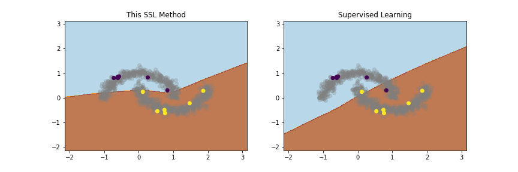
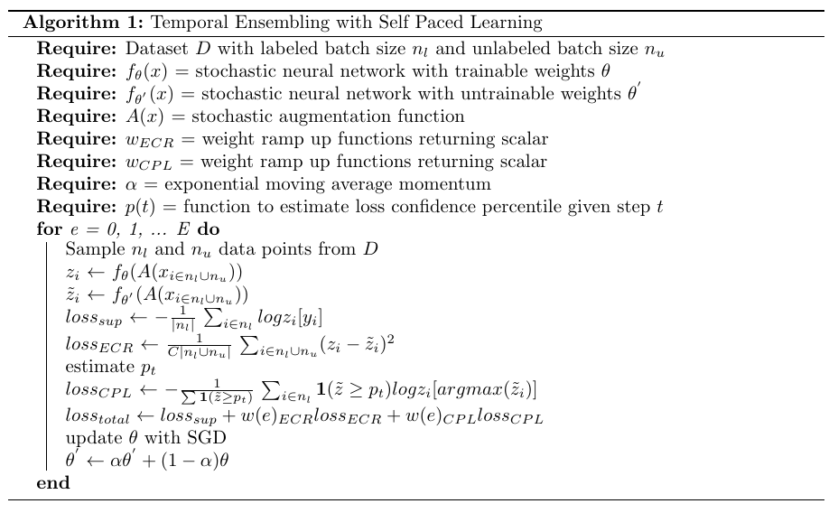

# Temporal Ensembling with Self Paced Learning for Semi-Supervised Learning

This repo test the addition of self-paced learning to [Temporal Ensembling for Learning with Noisy Labels](https://arxiv.org/abs/2109.14563). The goal is increment the line of research to display that robust learning to noisy labels can enhance the self-paced filtering for the unlabeled data within SSL.

Example decision boundaries on the two moon dataset with only 8 labeled data points (4 per class).

## Cifar10 Results

| Methods                 | N Labeled Data | Testset Error |
| ----------------------- | -------------- | ------------- |
| MT + CPL (this method)  | 4000           | 0.13          |
| MT (this implmnt)       | 4000           | 0.15          |
| Supervised              | 4000           | 0.20          |
| Supervised              | 50000          | 0.07          |

## Algorithm

