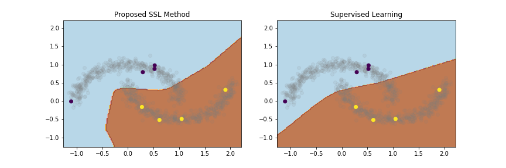

# Temporal Ensembling with Self Paced Learning for Semi-Supervised Learning

This repo test the addition of self-paced learning to the [Mean Teacher SSL method](https://arxiv.org/abs/1703.01780). The goal is increment the line of research to display that [curriculum pseudo-labels](https://arxiv.org/abs/2001.06001) can improve SSL methods that employ consistency regularization.

Example decision boundaries on the two moon dataset with only 8 labeled data points (4 per class).

## Cifar10 Results

| Methods                 | N Labeled Data | Testset Error |
| ----------------------- | -------------- | ------------- |
| MT + CPL (this method)  | 4000           | 0.123         |
| MT (this implmnt)       | 4000           | 0.128         |
| Supervised              | 4000           | 0.20          |
| Supervised              | 50000          | 0.07          |

## Algorithm

